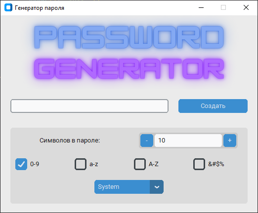

<h1 align="center">Password Generator</h1>

## Description / Описание

 Генератор паролей реализован на языке Python с использованием иблиотеки customtkiner.
 Основная идея взята в https://www.youtube.com/watch?v=ibf2u-rVb6o&t=562s.
 Модуль Spinbox заимствован с https://техномастерская.рф/customtkinter.
 
 Оригинальная документация представлена на https://customtkinter.tomschimansky.com/, а также https://github.com/TomSchimansky/CustomTkinter.
 
## How to play / Использование

- Задайте количество символов пароля.
- Выберите наборы символов, которые должны быть в пароле.
- Создайте свой пароль. Скопировать его можно, выделив в поле генерации.

### Оформление

В программе реализована смена тем - светлая и тёмная.